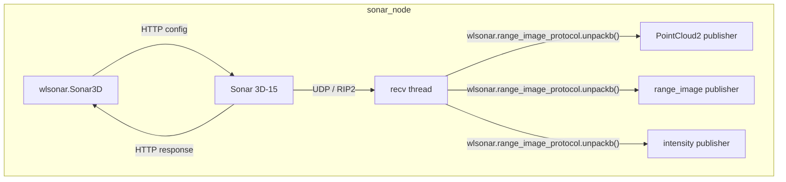

# waterlinked_sonar_3d15

ROS 2 driver for the [Water Linked Sonar 3D-15](https://www.waterlinked.com/3dsonar), built on the official [`wlsonar`](https://github.com/waterlinked/wlsonar) Python library.

## Features

- **High / low frequency mode** switching (firmware >= 1.7.0)
- **PointCloud2**, **range image**, and **intensity image** publishing
- Full sonar configuration via ROS parameters (speed of sound, range, salinity, UDP mode)
- Runtime parameter reconfiguration
- Diagnostic publishing (temperature, system status)
- Non-blocking UDP receiver (dedicated thread)
- Clean shutdown with acoustics disable

## Requirements

- ROS 2 (Humble / Jazzy / Rolling)
- Python >= 3.10
- Water Linked Sonar 3D-15 with firmware >= 1.5.1 (>= 1.7.0 for mode/salinity features)

## Installation

### Install the `wlsonar` dependency

```bash
pip install wlsonar
```

### Build the package

```bash
cd ~/your_ws
colcon build --packages-select waterlinked_sonar_3d15
source install/setup.bash
```

## Usage

### Launch with default parameters

```bash
ros2 launch waterlinked_sonar_3d15 sonar_3d15.launch.py
```

### Launch with custom parameters

```bash
ros2 launch waterlinked_sonar_3d15 sonar_3d15.launch.py \
    params_file:=/path/to/your_params.yaml
```

### Run the node directly

```bash
ros2 run waterlinked_sonar_3d15 sonar_node --ros-args \
    -p sonar_ip:=192.168.194.96 \
    -p mode:=high-frequency \
    -p acoustics_enabled:=true
```

## Topics

| Topic | Type | Description |
|---|---|---|
| `~/point_cloud` | `sensor_msgs/PointCloud2` | XYZ point cloud from range images |
| `~/range_image` | `sensor_msgs/Image` (32FC1) | Range image as float32 distances in meters |
| `~/intensity_image` | `sensor_msgs/Image` (8UC1) | Logarithmic signal strength image |
| `~/camera_info` | `sensor_msgs/CameraInfo` | Sonar lens model (pinhole projection) |
| `/diagnostics` | `diagnostic_msgs/DiagnosticArray` | Temperature, firmware, system status |

Topic names are configurable via the `topic_*` parameters (see below). The defaults above use the `~/` prefix, which resolves relative to the node name.

## Parameters

| Parameter | Type | Default | Description |
|---|---|---|---|
| `sonar_ip` | string | `192.168.194.96` | IP address of the Sonar 3D-15 |
| `frame_id` | string | `sonar_link` | TF frame ID for published messages |
| `acoustics_enabled` | bool | `true` | Enable acoustic imaging |
| `speed_of_sound` | double | `1480.0` | Speed of sound in m/s |
| `mode` | string | `low-frequency` | `low-frequency` or `high-frequency` (fw >= 1.7.0) |
| `salinity` | string | `salt` | `salt` or `fresh` (fw >= 1.7.0) |
| `range_min` | double | `0.3` | Minimum imaging range in meters |
| `range_max` | double | `15.0` | Maximum imaging range in meters |
| `udp_mode` | string | `multicast` | `multicast` or `unicast` |
| `interface_ip` | string | `0.0.0.0` | Local IP for multicast join / unicast bind |
| `unicast_destination_ip` | string | `""` | Unicast destination IP |
| `unicast_destination_port` | int | `0` | Unicast destination port |
| `topic_point_cloud` | string | `~/point_cloud` | Topic name for PointCloud2 output |
| `topic_range_image` | string | `~/range_image` | Topic name for range image output |
| `topic_intensity_image` | string | `~/intensity_image` | Topic name for intensity image output |
| `topic_camera_info` | string | `~/camera_info` | Topic name for CameraInfo output |
| `diagnostics_period` | double | `5.0` | Seconds between diagnostic queries |

### Changing parameters at runtime

The following parameters can be changed while the node is running using `ros2 param set`:

| Parameter | Example value | Notes |
|---|---|---|
| `acoustics_enabled` | `true` / `false` | Turns acoustic imaging on or off |
| `speed_of_sound` | `1500.0` | Adjust for water conditions (m/s) |
| `mode` | `low-frequency` / `high-frequency` | Requires firmware >= 1.7.0 |
| `salinity` | `salt` / `fresh` | Requires firmware >= 1.7.0 |
| `range_min` | `0.5` | Minimum imaging range (meters) |
| `range_max` | `10.0` | Maximum imaging range (meters) |

First, find the node name:

```bash
ros2 node list
```

Then set any parameter (replace `<node_name>` with the result above, e.g. `/sonar_node`):

```bash
ros2 param set <node_name> mode high-frequency
ros2 param set <node_name> range_max 10.0
ros2 param set <node_name> acoustics_enabled false
```

You can also inspect the current value of any parameter:

```bash
ros2 param get <node_name> mode
```

All other parameters (`sonar_ip`, `frame_id`, `udp_mode`, `interface_ip`, `unicast_destination_ip`, `unicast_destination_port`, `topic_*`, `diagnostics_period`) are read-only after startup and require a node restart to change.

## Architecture



## Diagnostics Tool

The package includes a standalone diagnostics node (`sonar_diag`) for benchmarking the sonar.

### Launch with parameters file

```bash
ros2 launch waterlinked_sonar_3d15 sonar_diag.launch.py
# or with a custom params file:
ros2 launch waterlinked_sonar_3d15 sonar_diag.launch.py params_file:=/path/to/diag_params.yaml
```

### Continuous monitoring

Prints live data rates and range/intensity image timing offsets every second:

```bash
ros2 run waterlinked_sonar_3d15 sonar_diag --ros-args \
    -p sonar_ip:=192.168.2.190 \
    -p interface_ip:=192.168.2.1
```

Example output:

```
[INFO] --- Sonar Diagnostics ---
[INFO]   RangeImage:  4.2 Hz  (seq 1042, 150x16, freq 750000 Hz)
[INFO]   BitmapImage: 4.1 Hz  (seq 1042, 150x16, freq 750000 Hz)
[INFO]   RI-BI offset: 12.3 ms avg (last 10 pairs)
```

### Mode-switch latency test

Measures how long it takes to switch between low-frequency and high-frequency modes, and how long until data resumes after each switch:

```bash
ros2 run waterlinked_sonar_3d15 sonar_diag --ros-args \
    -p sonar_ip:=192.168.2.190 \
    -p interface_ip:=192.168.2.1 \
    -p test_switch:=true \
    -p cycles:=3
```

Reports API call latency, data blackout duration, and confirms the resolution changed by logging the first image dimensions after each switch.

### Diagnostics parameters

| Parameter | Type | Default | Description |
|---|---|---|---|
| `sonar_ip` | string | `192.168.194.96` | IP address of the Sonar 3D-15 |
| `udp_mode` | string | `multicast` | `multicast` or `unicast` |
| `interface_ip` | string | `0.0.0.0` | Local interface IP for socket bind |
| `unicast_destination_ip` | string | `""` | Unicast destination IP |
| `unicast_destination_port` | int | `0` | Unicast destination port |
| `test_switch` | bool | `false` | Run mode-switch test instead of monitoring |
| `cycles` | int | `3` | Number of switch cycles for the test |

## Sonar Modes

The Sonar 3D-15 (firmware >= 1.7.0) supports two imaging modes:

| Mode | Horizontal Res | Vertical Res | Image Size |
|---|---|---|---|
| `low-frequency` | 0.6° (150 px) | 2.4° (16 px) | 2400 pixels |
| `high-frequency` | 0.4° (225 px) | 1.1° (36 px) | 8100 pixels |

Both modes have 90° horizontal and 40° vertical FOV.

## License

MIT
